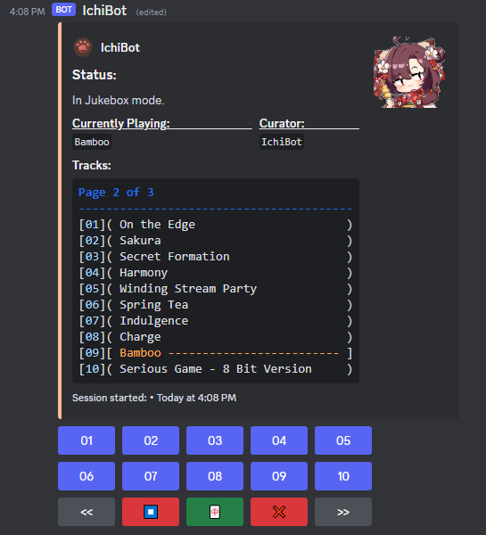

# IchiBot

The third generation of the Riichi music player. Built for personal use.

## Description

**IchiBot** chimes in for F2P players to jam to their favorite tunes while playing Mahjong! Users pool ambient/idle tracks into a shared **[hanchan]** playlist that shuffles during play. When a player declares **Riichi**, *IchiBot* switches to an intense, action-packed track from their personal **[riichi]** playlist to throw down the gauntlet in style!

**IchiBot** works with *Discord*'s Embed system, and as such comes with a sleek GUI for accessibility.

V3 now comes with **Jukebox Mode**!

- Comes with all OSTs found in *MahjongSoul* as baseline tracks in case users do not want to curate their own playlists. This option can be disabled on a per-server basis.

## Notice

The code is free for viewing and repurposing. Unlike traditional Discord Music Bots, IchiBot works on raw audio links instead of streaming media like *YouTube* videos.

You are welcome to adapt the code to your own bot. Accreditation is greatly appreciated. However, if you end up using *YouTube* links, *Spotify* or similar more often, it is probably best you stick to traditional Discord Bots that use video/audio streams.

- *GitHub Issues* are disabled as this bot was made for personal use.

**Disclaimer:** **IchiBot** uses *Ichihime* for its theme who is a character from *MahjongSoul*, as well as its OST as base tracks. Original character and music copyright remains with the developers of the game: Yostar & Catfood Studio.